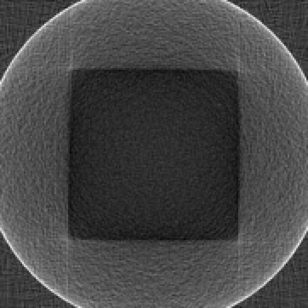

# README

- Report
- 2024.09.09 - 11.24.

## Contents

- [Overview](#overview)
  - [X-ray Computed Tomography (CT)](#x-ray-computed-tomography-ct)
    - [Absorption Contrast Imaging](#absorption-contrast-imaging)
    - [X-ray CT Geometries](#x-ray-ct-geometries)
  - [Reconstruction](#reconstruction)
    - [Projections](#projections)
    - [Radon Transformation](#radon-transformation)
    - [Sinogram](#sinogram)
    - [Filtered Back-Projection (FBP)](#filtered-back-projection)
  - [References](#references)
- [Run and Timing](#run-and-timing)
  - [Multiple Runs](#multiple-runs)
- [Actors](#actors)

## Overview

This README provides an overview of X-ray Computed Tomography (CT), including its principles, reconstruction algorithms, and simulation using OpenGATE. It also details how to set up and run multiple simulations with different timing intervals and explains the roles of various actors in the simulation process.

### X-ray Computed Tomography (CT)

A non-destructive imaging technique used to scan the internal density distribution of an object.

- Mechanism:
    - An X-ray source and a detector rotate around the object.
    - Multiple 2D projections are captured from different angles.
    - Projections are combined using reconstruction algorithms to create a 3D/2D image of the object.

#### Absorption Contrast Imaging

Leverages the differences in X-ray absorption rates within the object to generate contrast in the images.

- Mechanism:
  - X-rays pass through the object and are absorbed to varying degrees based on the material's properties.
  - Denser or thicker areas absorb more X-rays, resulting in lower intensity on the detector.
  - This contrast enables the differentiation of various structures within the object.

#### X-ray CT Geometries

The geometry of the CT system influences the data acquisition process and the reconstruction algorithms used.

- Types:
  - **Parallel Beam**
  - **Fan Beam**
  - **Cone Beam**

### Reconstruction

**Reconstruction** is the mathematical process of converting collected 2D projections into a 3D image by estimating the internal distribution of the X-ray attenuation coefficients within the object.

- **Purpose:**
  - To "back-calculate" the absorption coefficient distribution based on observed projections.
  - To generate cross-sectional images or volumetric data for analysis.

- **Algorithms:**
  - **Filtered Back-Projection (FBP)**
  - **Iterative Reconstruction**
  - **Deep Learning Techniques**

- **Steps:**
  1. **Data Collection:** Acquire 2D projections at various angles around the object.
  2. **Image Reconstruction:** Apply mathematical algorithms to reconstruct the 3D data or generate CT cross-sectional images from these projections.
  3. **Output Generation:** Store the reconstructed images in formats like TIFF stacks or DICOM files for visualization and analysis.

#### Projections

- **Definition:**
  - A **projection** is a 2D image that represents the attenuation of X-rays as they pass through the object at a specific angle.

#### Radon Transformation

The **Radon Transformation** is a mathematical tool that relates the internal structure of an object to the projections obtained from different angles.

#### Sinogram

Visual representation of the projection data collected during a CT scan, illustrating how the projections vary with rotation angle.

- **Usage:**
  - Serves as the raw data input for reconstruction algorithms like FBP.
  - Allows for the detection of inconsistencies or artifacts in the data acquisition process.

**Example** of a cube geometry's sinogram via parallel beam CT:


#### Inverse Radon Transformation

Reconstructs the original 2D image (slice) from the sinogram.

- The sinogram is transposed to align properly for reconstruction.

**Example** of the previously mentioned cube's reconstruction:



#### Filtered Back Projection


#### References

- [`opengate`](https://github.com/OpenGATE/opengate) and its [documentation](https://opengate-python.readthedocs.io/en/master/)
- [CT Reconstruction](https://rigaku.com/products/imaging-ndt/x-ray-ct/learning/blog/how-does-ct-reconstruction-work)

## [Run and timing](https://opengate-python.readthedocs.io/en/master/user_guide/user_guide_reference_simulation.html#run-and-timing)

The simulation can be split into several runs, each with a given time duration. This is used for example for simulations with a dynamic geometry, e.g. a rotating gantry or a breathing patient. Gaps between the intervals are allowed. 

By default, the simulation has only one run with a duration of 1 second:
```python
sim.run_timing_intervals = [[0, 1.0 * sec]]
```

### Multiple runs

Splitting a simulation into multiple runs is faster than executing a simulation multiple times.

Let's define 3 runs with a gap from 1.0 to 1.5 seconds:
```python
sim.run_timing_intervals = [
    [0, 0.5 * sec],         # 1st run
    [0.5 * sec, 1.0 * sec], # 2nd run
    [1.5 * sec, 2.5 * sec], # 3rd run
]
```

## Actors

### [`DigitizerHitsCollectionActor`](https://opengate-python.readthedocs.io/en/master/user_guide/user_guide_reference_actors.html#digitizerhitscollectionactor)

The DigitizerHitsCollectionActor collects hits occurring in a given volume (or its daughter volumes). Every time a step occurs in the volume, a list of attributes is recorded. The list of attributes is defined by the user:
```python
hc = sim.add_actor('DigitizerHitsCollectionActor', 'Hits')
hc.attached_to = ['crystal1', 'crystal2']
hc.output_filename = 'test_hits.root'
hc.attributes = ['TotalEnergyDeposit', 'KineticEnergy', 'PostPosition',
                 'CreatorProcess', 'GlobalTime', 'VolumeName', 'RunID', 'ThreadID', 'TrackID']
```

### [`DigitizerProjectionActor`](https://opengate-python.readthedocs.io/en/master/user_guide/user_guide_reference_actors.html#opengate.actors.digitizers.DigitizerProjectionActor)

This actor takes as input HitsCollections and performed binning in 2D images. If there are several HitsCollection as input, the slices will correspond to each HC. If there are several runs, images will also be slice-stacked.
